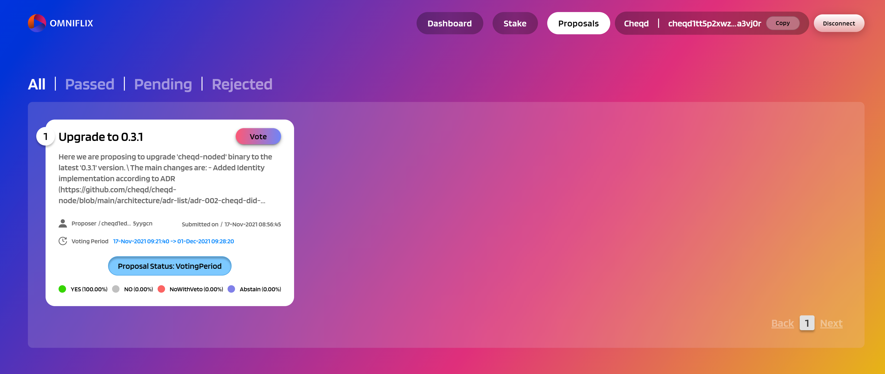

# How do I stake, delegate and vote practically?

Governance on cheqd is carried out through our [Governance Dashboard](https://cheqd.omniflix.co). This can always be found at the link:

[https://cheqd.omniflix.co/](https://cheqd.omniflix.co)

.png>)

This initial dashboard enables Users to:

1. Connect to their Keplr wallet
2. View their available token balance
3. View the amount of tokens staked
4. View available rewards
5. View unstaked tokens

This dashboard gives a holistic view of the tokens that Users hold at any point and where they are being used.

### How do I connect my Keplr wallet?

Make sure you are logged into [Keplr](https://www.keplr.app) on the same browser you are using the Governance Dashboard on.

For more on setting up Keplr, read our [blog here](https://blog.cheqd.io/were-launching-the-cheq-token-very-soon-here-s-how-you-can-get-ready-8fc6a7833fbb)

If you click the button "**Connect" **in the top right hand corner you will get a pop up, like the image below.&#x20;

This will begin the process of "**Auto-discovery"**:

.png>)

Click **"Approve" **and this will attempt to connect your Keplr Wallet to the Governance Dashboard. You will see it connected on the dashboard in the top right, and your cheqd address linked.&#x20;

If you select cheqd on the dropdown menu in keplr, you should be able to access your CHEQ in your keplr wallet!

### How do I send tokens to another address?

If you press the "**Send**" button on Keplr, you will be able to choose the cheqd wallet address you send your CHEQ to, and the specific amount of CHEQ:

.png>)


The memo is a message that will appear for everyone on the blockchain, so please do not write personal data, or personally identifiable information in the memo field


### How do I delegate and stake my tokens?

On the dashboard you can either click **"Stake Tokens"** or click the tab in the right hand corner called **"Stake".**

 (1).png>)

You will be able to see a list of all the Validators, their voting power and their associated commission rate. You can read about what all these parameters mean below:


[key-terms-and-faqs.md](../../getting-started/learning-the-basics/key-terms-and-faqs.md)


Press the button **"Delegate" **on your desired Validating Node Operator.&#x20;

&#x20;

.png>)

Enter the amount of tokens you want to delegate.

And voila! You have now delegated to a Node Operator and staked your tokens.&#x20;

### How do I vote on Governance Proposals?

To view the active Governance Proposals, click the tab **"Proposals" **in the top right menu.&#x20;

You will be able to see all active Governance Proposals. If you click on the specific Proposal, you will be able to easily vote on it.&#x20;

 (1).png>)

Select your vote and hit **"Confirm"**
